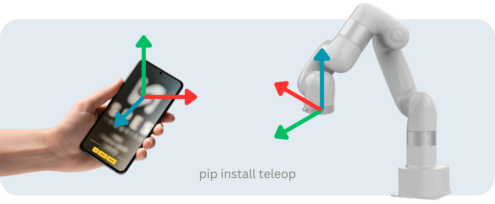

Transform your phone into a robot arm teleoperation device in three simple steps:

1. Install and launch the server on your computer.
2. Open the provided URL on your phone.
3. Tap `Start`, then press and hold the `Move` button to control the robot arm.

The web application leverages the WebXR API, which combines your phone’s sensors to detect its orientation and position in 3D space. The server receives this data and sends it to the robot arm controller.

|   |  |
|:-------------------------------------------------------------------:|:----------------------------------------------------:|
| Teleoperation of a physical Lite6 robot                             | Teleoperation of a simulated UR5e robot in Webots    |

## Installation

The package is available on [PyPI](https://pypi.org/project/teleop/). You can install it using pip:

```bash
pip3 install teleop
```

## Usage

We provide some ready-to-use robot arm interfaces, but you can also create your own by incorporating the [`teleop.Teleop`](./teleop/__init__.py) class into your project.

### Basic Interface

A simple interface that prints the teleop responses. You can use it as a reference to build your own interface.

```bash
python3 -m teleop.basic
```

### ROS 2 Interface

The ROS 2 interface is designed primarily for use with the [cartesian_controllers](https://github.com/fzi-forschungszentrum-informatik/cartesian_controllers) package, but it can also be adapted for [MoveIt Servo](https://moveit.picknik.ai/main/doc/examples/realtime_servo/realtime_servo_tutorial.html) or other packages.

```bash
python3 -m teleop.ros2
```

**Published topics:**
- `target_frame` ([geometry_msgs/PoseStamped](https://docs.ros2.org/latest/api/geometry_msgs/msg/PoseStamped.html)): The target pose of the robot arm’s end effector in the robot base frame.
- `tf` ([tf2_msgs/TFMessage](https://docs.ros2.org/latest/api/tf2_msgs/msg/TFMessage.html)): The transform between the robot base frame and the target frame for visualization.

**Subscribed topics:**
- `current_pose` ([geometry_msgs/PoseStamped](https://docs.ros2.org/latest/api/geometry_msgs/msg/PoseStamped.html)): The current pose of the robot arm’s end effector in the robot base frame. Used to update the reference pose.

You can override the default topic names using standard ROS 2 arguments:

```bash
python3 -m teleop.ros2 --ros-args -r target_frame:=/some_other_topic_name
```

### Custom Interface

For most applications, you will need to create a custom interface to interact with your robot arm. Here’s an example:

```python
import numpy as np
from teleop import Teleop


def callback(pose: np.ndarray, message: dict) -> None:
    """
    Callback function triggered when pose updates are received.
    Arguments:
        - np.ndarray: A 4x4 transformation matrix representing the end-effector target pose.
        - dict: A dictionary containing additional information.
    """
    print(f'Pose: {pose}')
    print(f'Message: {message}')

teleop = Teleop()
teleop.subscribe(callback)
teleop.run()
```

## Examples

Explore the examples to learn how to use the package in various scenarios:

- [examples/webots](./examples/webots): Teleoperation of a UR5e robot arm using [ikpy](https://github.com/Phylliade/ikpy) in the [Webots](https://github.com/cyberbotics/webots/) simulator.

## Development

If you’d like to contribute, install the package in editable mode:

```bash
# Install the package in editable mode
git clone https://github.com/SpesRobotics/teleop.git
cd teleop
pip3 install -e .

# Run the tests
python3 -m pytest
```
