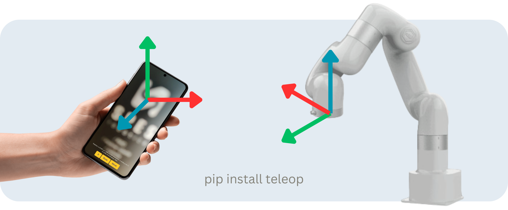

Transform your phone into a robot arm teleoperation device in three simple steps:

1. Install and launch the server on your computer.
2. Open the provided URL on your phone.
3. Tap `Start`, then press and hold the `Move` button to control the robot arm.

> [!IMPORTANT]  
> Your phone has to support the [WebXR API](https://developer.mozilla.org/en-US/docs/Web/API/WebXR_Device_API). To use `teleop` on an iPhone, install and open either [XR Browser](https://apps.apple.com/app/xr-browser/id1588029989) or [WebXR Viewer](https://apps.apple.com/app/webxr-viewer/id1295998056), then navigate to `<server-hostname>:5000` to open the teleoperation web app. Safari on iPhone doesn't support WebXR.

The web application leverages the WebXR API, which combines your phone’s sensors to detect its orientation and position in 3D space. The server receives this data and sends it to the robot arm controller.

|   |  |
|:-------------------------------------------------------------------:|:----------------------------------------------------:|
| Teleoperation of a physical Lite6 robot                             | Teleoperation of a simulated UR5e robot in Webots    |

## Installation

The package is available on [PyPI](https://pypi.org/project/teleop/). You can install it using pip:

```bash
pip install teleop
```

## Usage

We provide some ready-to-use robot arm interfaces, but you can also create your own by incorporating the [`teleop.Teleop`](./teleop/__init__.py) class into your project.

### Basic Interface

A simple interface that prints the teleop responses. You can use it as a reference to build your own interface.

```bash
python -m teleop.basic
```

### xArm

Interface to teleoperate the [uFactory Lite 6](https://www.ufactory.cc/lite-6-collaborative-robot/) robot.
Minor changes are probably necessary to support other xArm robots.

```bash
python -m teleop.xarm
```

Note that the interface is very simple, it doesn't implement any kind of filtering.
Therefore, you probably want to teleoperate it with a device with high frequency.
Smart phones are typically 30fps while VR joysticks 90fps which is much more preferable for teleoperation without filtering.

### ROS 2 Interface

The ROS 2 interface is designed primarily for use with the [cartesian_controllers](https://github.com/fzi-forschungszentrum-informatik/cartesian_controllers) package, but it can also be adapted for [MoveIt Servo](https://moveit.picknik.ai/main/doc/examples/realtime_servo/realtime_servo_tutorial.html) or other packages.

```bash
python -m teleop.ros2
```

**Published topics:**
- `target_frame` ([geometry_msgs/PoseStamped](https://docs.ros2.org/latest/api/geometry_msgs/msg/PoseStamped.html)): The target pose of the robot arm’s end effector in the robot base frame.
- `tf` ([tf2_msgs/TFMessage](https://docs.ros2.org/latest/api/tf2_msgs/msg/TFMessage.html)): The transform between the robot base frame and the target frame for visualization.

**Subscribed topics:**
- `current_pose` ([geometry_msgs/PoseStamped](https://docs.ros2.org/latest/api/geometry_msgs/msg/PoseStamped.html)): The current pose of the robot arm’s end effector in the robot base frame. Used to update the reference pose.

You can override the default topic names using standard ROS 2 arguments:

```bash
python -m teleop.ros2 --ros-args -r target_frame:=/some_other_topic_name
```

### ROS 2 Interface with IK

No servoing support, no problem.
`teleop` provides servoing support through the [JacobiRobotROS](#JacobiRobotROS) util class.

Panda arm usage example:
```bash
python -m teleop.ros2_ik \
  --joint-names panda_joint1 panda_joint2 panda_joint3 panda_joint4 panda_joint5 panda_joint6 panda_joint7 \
  --ee-link panda_hand \
  --ros-args -r /joint_trajectory:=/panda_arm_controller/joint_trajectory
```

xArm usage example:
```bash
python -m teleop.ros2_ik \
  --joint-names joint1 joint2 joint3 joint4 joint5 joint6 \
  --ee-link link6 \
  --ros-args -r /joint_trajectory:=/joint_trajectory_controller/joint_trajectory
```

### Custom Interface

For most applications, you will need to create a custom interface to interact with your robot arm. Here’s an example:

```python
import numpy as np
from teleop import Teleop


def callback(pose: np.ndarray, message: dict) -> None:
    """
    Callback function triggered when pose updates are received.
    Arguments:
        - np.ndarray: A 4x4 transformation matrix representing the end-effector target pose.
        - dict: A dictionary containing additional information.
    """
    print(f'Pose: {pose}')
    print(f'Message: {message}')

teleop = Teleop()
teleop.subscribe(callback)
teleop.run()
```

## Examples

Explore the examples to learn how to use the package in various scenarios:

- [examples/webots](./examples/webots): Teleoperation of a UR5e robot arm using [ikpy](https://github.com/Phylliade/ikpy) in the [Webots](https://github.com/cyberbotics/webots/) simulator.

## Utils

The package includes several utility classes to simplify robot arm integration:

> [!NOTE]  
> To use the utility classes, install the package with the additional dependencies:
> ```bash
> pip install teleop[utils]
> ```

### JacobiRobot

A Pinocchio-based servoing and kinematics for robotic manipulators.

**Key Features:**
- Forward/inverse kinematics using Pinocchio
- Pose-based servo control with velocity/acceleration limits  
- Real-time 3D visualization
- Joint-level control and monitoring

**Usage:**
```python
from teleop.utils.jacobi_robot import JacobiRobot

robot = JacobiRobot("robot.urdf", ee_link="end_effector")
target_pose = np.eye(4)  # 4x4 transformation matrix
reached = robot.servo_to_pose(target_pose, dt=0.01)
```

### JacobiRobotROS

ROS 2 wrapper for JacobiRobot that integrates with standard ROS 2 topics and messages.

**Key Features:**
- Automatic URDF loading from `/robot_description` topic
- Joint state subscription and trajectory publishing
- Compatible with `joint_trajectory_controller`
- Seamless integration with existing ROS 2 control stacks

**Usage:**
```python
from teleop.utils.jacobi_robot_ros import JacobiRobotROS
import rclpy

rclpy.init()
node = rclpy.create_node("robot_control")

robot = JacobiRobotROS(
    node=node,
    ee_link="end_effector",
    joint_names=["joint1", "joint2", "joint3"]
)

robot.reset_joint_states()  # Wait for initial joint states
reached = robot.servo_to_pose(target_pose, dt=0.03)
```

| **Topic** | **Type** | **Message Type** | **Description** |
|-----------|----------|------------------|-----------------|
| `/joint_states` | Subscribed | [sensor_msgs/JointState](https://docs.ros2.org/latest/api/sensor_msgs/msg/JointState.html) | Current joint positions and velocities |
| `/robot_description` | Subscribed | [std_msgs/String](https://docs.ros2.org/latest/api/std_msgs/msg/String.html) | URDF robot description |
| `/joint_trajectory_controller/joint_trajectory` | Published | [trajectory_msgs/JointTrajectory](https://docs.ros2.org/latest/api/trajectory_msgs/msg/JointTrajectory.html) | Joint trajectory commands for robot control |

## Development

If you’d like to contribute, install the package in editable mode:

```bash
# Install the package in editable mode
git clone https://github.com/SpesRobotics/teleop.git
cd teleop
pip install -e .

# Run the tests
python -m pytest
```
