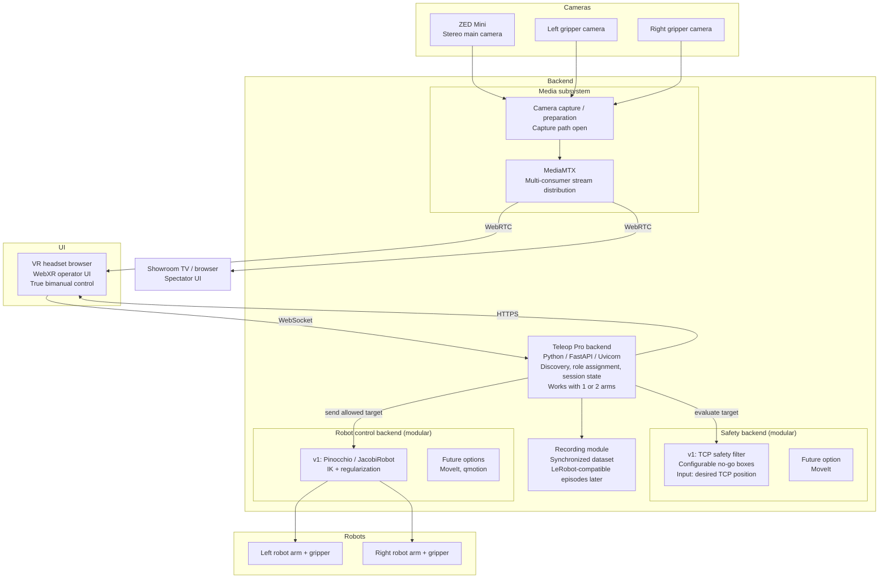

# Architecture

This document summarizes the current architecture plan based only on the decisions made so far.

## System Diagram



## System Overview

- The backend is the system shell and owns startup, discovery, role assignment, session state, recording coordination, safety, and robot control coordination.
- The system must work with either one arm or two arms.
- The operator uses a browser in a VR headset.
- The VR headset is used for first-person viewing and bimanual controller input.
- Head motion is not used for robot control.
- The showroom TV is another stream consumer.
- The backend owns the media subsystem. Cameras connect into the backend, and the backend makes those streams available through MediaMTX.

## Module Boundaries

- `Backend shell`
  - Libraries: `Python`, `FastAPI`, `Uvicorn`
  - Responsibilities: startup, discovery, role assignment, session state, UI serving, protocol coordination
- `Media subsystem`
  - Technology: `MediaMTX`
  - Browser streaming protocol: `WebRTC`
  - Covered so far: main stereo ZED stream, optional gripper camera streams, multiple consumers
  - Open: exact camera capture path and exact ingest path into MediaMTX
- `UI`
  - Technology: `WebXR`
  - Optional frontend stack discussed: `React`, `Zustand`, `Immer`, `UIKit`
  - Covered so far: operator UI in headset, simple status/control UI, recording start/stop, optional gripper camera views
- `Safety backend`
  - v1 backend: custom TCP-position safety filter with multiple configurable no-go boxes
  - Future optional backend: `MoveIt`
  - Covered so far: a desired TCP position is checked against configured boxes and the safety backend returns a decision to the backend shell
- `Robot control backend`
  - v1 backend: `Pinocchio` with the current [JacobiRobot](../teleop/utils/jacobi_robot.py) module
  - Future optional backends: `MoveIt`, `qmotion`
  - Covered so far: keep the current approach, improve it iteratively, do not fundamentally replace it in v1
- `Recording`
  - Covered so far: synchronized recording owned by this repo, start/stop from UI, target is LeRobot-compatible episodes later

## Protocols And Libraries

- `HTTPS`
  - Backend serves the browser UI
- `WebSocket`
  - Browser-to-backend control and status path
  - Covered so far: controller poses, button state, recording commands, general app communication
- `WebRTC`
  - Media delivery from backend media subsystem to VR headset browser and TV/browser
- `MediaMTX`
  - Multi-consumer media distribution
- `WebXR`
  - Browser-side VR presentation and controller input
- `Pinocchio`
  - Current robot control / IK backend
- `FastAPI` and `Uvicorn`
  - Current backend foundation
- `In-process Python calls`
  - Backend shell, safety backend, robot control backend, and recorder are currently planned as modules inside the same Python process
  - Communication between these backend modules is planned as normal Python class method calls, not as network calls

## Backend Internal API

For the `Teleop Pro backend -> safety backend -> robot control backend` path, the current v1 direction is:

- The safety backend is a Python class selected by configuration.
- The robot control backend is a Python class selected by configuration.
- The backend shell owns both objects and orchestrates the call order.
- The safety backend should not directly talk to the robot controller.
- Instead, the safety backend should return a decision to the backend shell, and the backend shell should decide whether to call the robot control backend.

This keeps the safety backend modular and makes it easier to replace the v1 safety module with a future `MoveIt` backend.

### Proposed v1 module split

- `TeleopBackend`
  - owns session state
  - receives operator commands from the browser
  - constructs target commands for each arm
  - calls the safety backend
  - if allowed, calls the robot control backend
  - sends status/errors back to the UI
- `SafetyBackend`
  - receives a desired target for one arm
  - checks the target TCP position against configured no-go boxes
  - returns allow/block information and optional adjusted target data
- `RobotControlBackend`
  - receives an allowed target
  - converts the target into robot motion using the selected control backend
  - sends commands to the robot driver/API

### Proposed v1 data flow

```text
browser command
-> TeleopBackend
-> SafetyBackend.evaluate_target(...)
-> SafetyResult
-> if allowed: RobotControlBackend.send_target(...)
-> robot
```

### Proposed v1 Python-style interface

```python
from dataclasses import dataclass
from typing import Literal


ArmId = Literal["left", "right"]


@dataclass
class PoseTarget:
    arm: ArmId
    tcp_pose: object
    gripper_command: str | None = None
    timestamp_ms: int | None = None


@dataclass
class SafetyResult:
    allowed: bool
    target: PoseTarget | None
    reason: str | None = None
    violated_zone_ids: list[str] | None = None


class SafetyBackend:
    def evaluate_target(self, target: PoseTarget) -> SafetyResult:
        raise NotImplementedError


class RobotControlBackend:
    def send_target(self, target: PoseTarget) -> None:
        raise NotImplementedError
```

The exact pose type is still open. The current decision is only that the safety API operates on a desired TCP target before the control backend sends robot commands.

### Proposed v1 safety backend configuration

The v1 safety backend can be constructed from:

- backend type, for example `basic` now and `moveit` later
- a list of configured no-go boxes
- per-arm enable/disable settings if needed later

Example shape:

```python
basic_safety = SafetyBackendBasic(
    boxes=[
        {
            "id": "basket_keepout",
            "frame": "world",
            "min": [0.40, -0.10, 0.15],
            "max": [0.55, 0.10, 0.35],
        }
    ]
)
```

The exact box schema is still open. The important current decision is that v1 uses multiple configurable Cartesian no-go boxes checked against TCP position.

## Control Sequence

The current intended control sequence is:

1. The browser sends operator input to the backend over `WebSocket`.
2. The backend converts that input into a desired per-arm TCP target.
3. The backend calls the selected safety backend with that target.
4. The safety backend returns a `SafetyResult`.
5. If the result is allowed, the backend calls the selected robot control backend.
6. The robot control backend computes and sends the robot command.
7. The backend can send status or rejection reasons back to the UI.

This is different from letting the safety module directly forward commands to the controller. The backend shell should remain the orchestrator.

## Current v1 Decisions

- Use `MediaMTX` for browser-facing media distribution.
- Keep media as part of the backend architecture.
- Keep `Pinocchio` / `JacobiRobot` as the v1 robot control backend.
- Make the robot control backend modular so that `MoveIt` or `qmotion` can be used later.
- Build a separate v1 safety module that filters desired TCP positions against multiple configurable no-go boxes.
- Make the safety module modular so that `MoveIt` can be used later.
- The safety backend and robot control backend are planned as in-process Python modules selected by configuration.
- The backend shell owns orchestration. The safety backend returns decisions; it does not directly own controller dispatch.
- Record synchronized session data in this repo. LeRobot-compatible episode details are deferred.

## JacobiRobot Notes

- The current IK implementation lives in [teleop/utils/jacobi_robot.py](../teleop/utils/jacobi_robot.py).
- The IK regularization is used to avoid singularities.
- This module should be improved through several iterations inside this project.
- The current direction is to avoid a fundamental rewrite, because the module is already the result of many failed iterations and has proven to work in practice.

## Open Questions

- Exact camera capture path for the ZED Mini and gripper cameras
- Exact ingest path from backend capture into MediaMTX
- Exact low-level robot driver / API path
- Exact control/data APIs
- Exact update rates and frequencies
- Exact format for the safety box configuration
- Exact behavior when a target is invalid beyond allow/block status
- Exact LeRobot-compatible episode schema details
- Whether the spectator UI is separate from the operator UI or shares the same frontend
