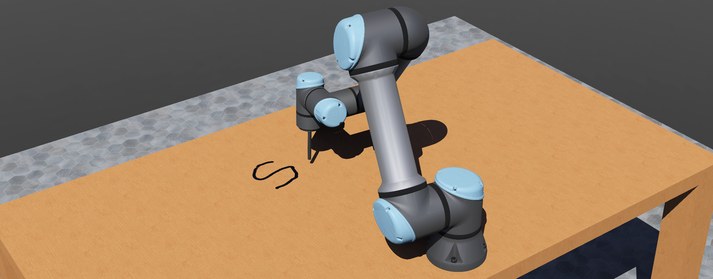

# Webots + ikpy + UR5e

An example that demonstrates teleoperation of a UR5e robot arm.

## Getting Started

Follow these instructions to run the example on your local machine:
- Install [Webots](https://cyberbotics.com/)
- Install [ikpy](https://github.com/Phylliade/ikpy) (`pip3 install ikpy`)
- Run the Webots simulation: `webots worlds/teleop.wbt`
- The `teleop` will automatically start and you can control the robot arm using your phone.
